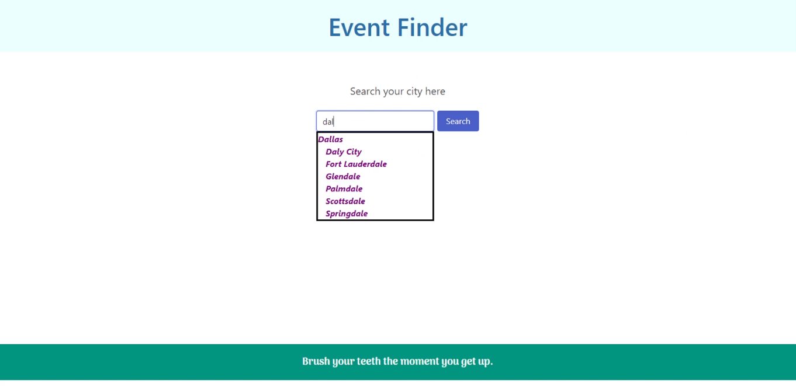
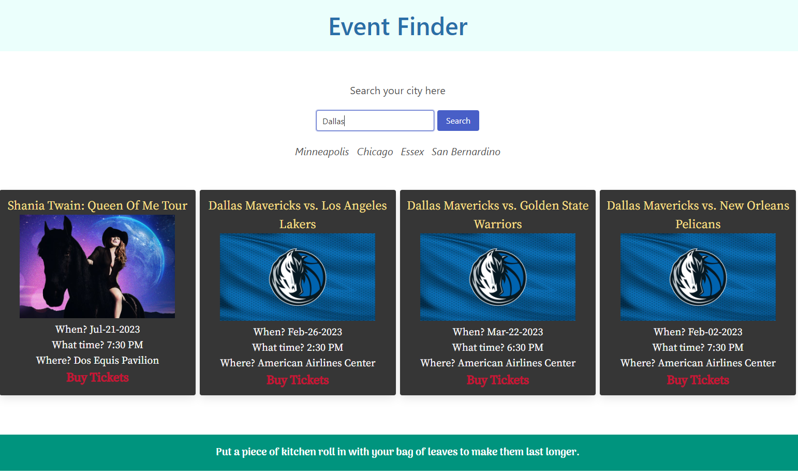

# Event Finder

## Description

The purpose of this project was to create an interactive webpage using two APIs to better understand the concepts of HTML, CSS framework, JavaScript, web APIs, third-party APIs, server-side APIs.\
This project is part of a challenge from full-stack coding bootcamp at the University of Minnesota.

## Installation

There is no installion process.

## Usage

In the search bar, type in a city and/or choose the city from the dropdown and press search.

Then, choose an event from the 4 posted resulted and click buy tickets.

At the bottom of the page, along your travels take some life advice on your journey.

## Credits

Micheala Holthus
GitHub Repository: https://github.com/Micheala-H?tab=repositories

Beatriz Jorgensen
GitHub Repository: https://github.com/BiaJorgensen?tab=repositories

Logan Ellingworth
GitHub Repository: https://github.com/loganeworth?tab=repositories

## License

Our project has an MIT license.

## Links

Deployed page: https://micheala-h.github.io/Event-finder/

GitHub Repository: https://github.com/Micheala-H/Event-finder